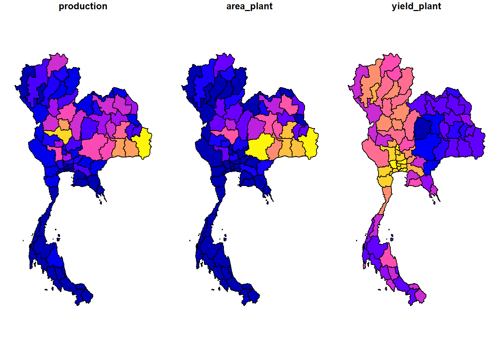

# mapthai

An R package storing ligtweight geospatial polygon data of Thailand
administrative level 1-3 including province (Changwat), district
(Amphoe) and subdistrict (Tambon) in geojson and rda (`sf` class)
format. Please see more details in [package
website](https://piyayut-ch.github.io/mapthai/)

**Notes:**  
- Thailand maps are downloaded from
[UNOCHA](https://data.humdata.org/dataset/thailand-administrative-boundaries)  
- Source: Royal Thai Survey Department update 6 November 2019  
- Maps are simplified using [mapshaper](https://mapshaper.org)  
\* Import Options : detect line intersections  
\* Simplification menu : check prevent shape removal  
\* Method : Visvalingam / effective area

# แผนที่ไทย

R package ที่มีไฟล์แผนที่ขนาดเล็กของไทย เหมาะสำหรับการทำ data
visualization มีไฟล์ทั้ง geojson และ rda (ในรูปแบบ class `sf`)
โดยแผนที่ไทยมี 3 ระดับ ได้แก่ จังหวัด อำเภอ และตำบล
ดูรายละเอียดเพิ่มเติมได้ที่ [package
website](https://piyayut-ch.github.io/mapthai/)

**หมายเหตุ:**  
- แผนที่ไทยโหลดมาจาก
[UNOCHA](https://data.humdata.org/dataset/thailand-administrative-boundaries)  
- แหล่งข้อมูล: กรมแผนที่ทหาร เมื่อวันที่ 6 พ.ย. 2562  
- ลดขนาดของแผนที่ (simplify) ด้วย webtool ที่ชื่อ
[mapshaper](https://mapshaper.org)  
โดยเลือกปรับแต่งค่าต่าง ๆ ดังนี้  
\* Import Options : detect line intersections  
\* Simplification menu : check prevent shape removal  
\* Method : Visvalingam / effective area

## Installation

You can install the released version of mapthai from [github
repo](https://github.com/piyayut-ch/mapthai) with:

``` r
# remotes::install_github("piyayut-ch/mapthai")
```

## Example

### 1. Plot map using plot method of `sf` class

``` r
library(mapthai)
library(sf)

# basic example code
plot(tha2[, c('adm2_pcode', 'adm1_pcode')]) 
```


### 2. Plot interactive plot using leaflet

``` r
library(leaflet)
leaflet(tha2) %>%
  addProviderTiles(providers$CartoDB) %>%
  addPolygons(color = "grey", weight = 1)
```

### 3. Reference table

``` r
library(dplyr)
library(gt)

ref_tha %>%
  head()
#>   adm3_pcode    adm3_en     adm3_th adm2_pcode        adm2_en      adm2_th
#> 1   TH420803       A Hi        อาฮี     TH4208         Tha Li       ท่าลี่
#> 2   TH940102     A Noru    อาเนาะรู     TH9401 Mueang Pattani เมืองปัตตานี
#> 3   TH321305     A Phon       อาโพน     TH3213        Buachet       บัวเชด
#> 4   TH950615     A Song      อาซ่อง     TH9506          Raman        รามัน
#> 5   TH550711  Ai Na Lai   อ่ายนาไลย     TH5507       Wiang Sa      เวียงสา
#> 6   TH950204 Aiyoe Weng อัยเยอร์เวง     TH9502         Betong         เบตง
#>   adm1_pcode adm1_en  adm1_th
#> 1       TH42    Loei      เลย
#> 2       TH94 Pattani  ปัตตานี
#> 3       TH32   Surin สุรินทร์
#> 4       TH95    Yala     ยะลา
#> 5       TH55     Nan     น่าน
#> 6       TH95    Yala     ยะลา
```

``` r
ref_tha %>% 
  filter(adm2_pcode == "TH1015")
#>   adm3_pcode      adm3_en    adm3_th adm2_pcode   adm2_en adm2_th adm1_pcode
#> 1   TH101503 Bang Yi Ruea บางยี่เรือ     TH1015 Thon Buri  ธนบุรี       TH10
#> 2   TH101504     Bukkhalo     บุคคโล     TH1015 Thon Buri  ธนบุรี       TH10
#> 3   TH101506  Dao Khanong   ดาวคะนอง     TH1015 Thon Buri  ธนบุรี       TH10
#> 4   TH101502   Hiranruchi  หิรัญรูจี     TH1015 Thon Buri  ธนบุรี       TH10
#> 5   TH101507        Samre     สำเหร่     TH1015 Thon Buri  ธนบุรี       TH10
#> 6   TH101505   Talat Phlu    ตลาดพลู     TH1015 Thon Buri  ธนบุรี       TH10
#> 7   TH101501  Wat Kanlaya วัดกัลยาณ์     TH1015 Thon Buri  ธนบุรี       TH10
#>   adm1_en       adm1_th
#> 1 Bangkok กรุงเทพมหานคร
#> 2 Bangkok กรุงเทพมหานคร
#> 3 Bangkok กรุงเทพมหานคร
#> 4 Bangkok กรุงเทพมหานคร
#> 5 Bangkok กรุงเทพมหานคร
#> 6 Bangkok กรุงเทพมหานคร
#> 7 Bangkok กรุงเทพมหานคร
```

### 4. Join `sf` object with data and plot

``` r
tha1 %>%
  left_join(rice_2562, by = c("adm1_th" = "location")) %>%
  select(production, area_plant, yield_plant) %>%
  plot()
```


